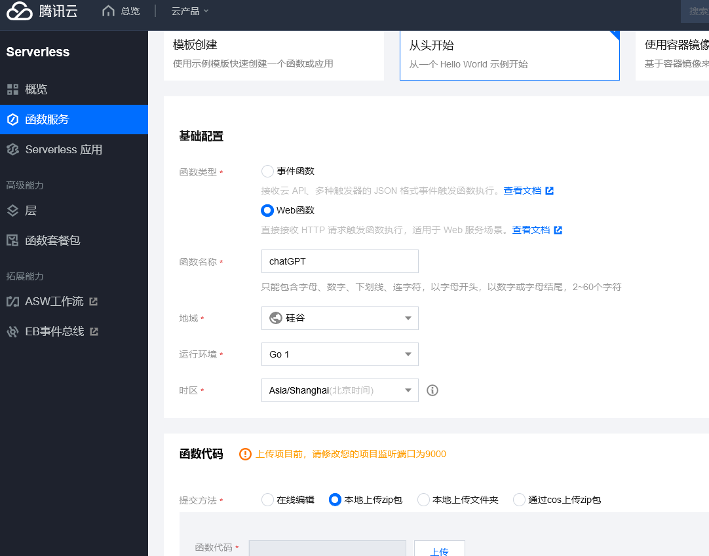
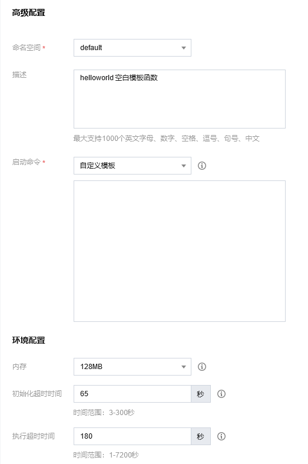
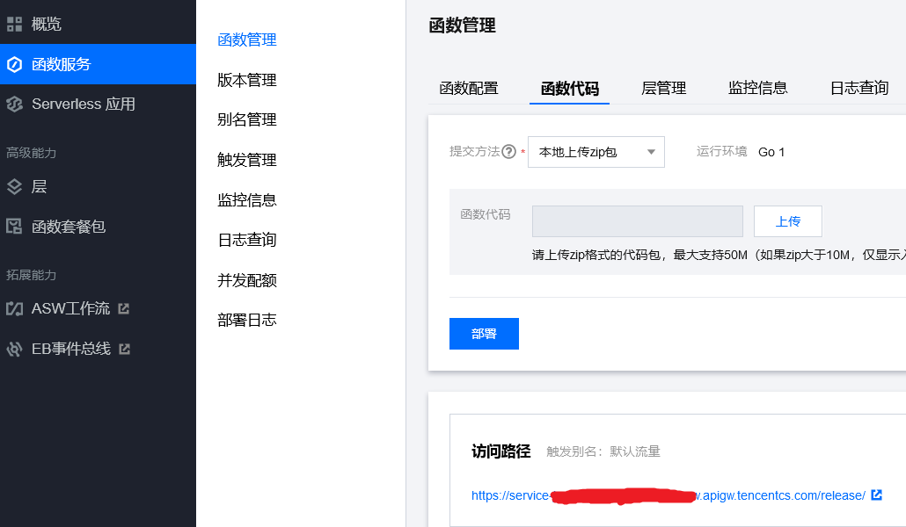

# ChatGPT_reverse_proxy

ChatGPT_reverse_proxy 是 ai api 反向代理。可以在自建服务器、云函数上使用。

* 默认支持 OpenAI API 反向代理，请求 api 时，直接把接口地址 ( https://api.openai.com ) 替换为反向代理服务的地址。
* 支持 Azure OpenAI API 反向代理，将 OXY_TARGET 环境变量修改为 Azure OpenAI
  服务地址示例：https://docs-test-001.openai.azure.com
   ```markdown
   Azure 检索密钥和服务地址
   https://learn.microsoft.com/zh-cn/azure/ai-services/openai/chatgpt-quickstart?tabs=command-line%2Cpython&pivots=programming-language-go
   ```

## 可用的环境变量

1. OXY_TARGET: 反向代理目标，默认=https://api.openai.com
2. OXY_PORT: 代理服务端口，默认=9000
3. OXY_HOP_HEADER_PREFIX: 跳过 http header 前缀，默认为空

## 自托管chatGPT反向代理服务

### 使用二进制发行版

1. 支持的操作系统

    * Windows
    * Linux
    * macOS
    * FreeBSD
    * OpenBSD

1. 下载 `chatgpt_reverse_proxy` [最新版本 releases](https://github.com/lenye/chatgpt_reverse_proxy/releases)

1. 开始运行它:

   linux

   如需重新定义环境变量
    ```shell
    $ export OXY_PORT=9000
    ```
   运行反向代理服务
    ```shell
    $ ./chatgpt_reverse_proxy
    ```

1. OpenAI API 端点地址样例：

    ```
    http://localhost:9000/v1/completions
    http://localhost:9000/v1/chat/completions
    ```

### docker

1. 拉取容器映像
   ```shell
   $ docker pull ghcr.io/lenye/chatgpt_reverse_proxy
   ```

1. docker compose

   docker_compose.yml
    ```yaml
    services:
       chatgpt_reverse_proxy:
          image: ghcr.io/lenye/chatgpt_reverse_proxy:latest
          restart: unless-stopped
          ports:
             - "9000:9000"
          volumes:
             - /etc/localtime:/etc/localtime:ro
             - /etc/timezone:/etc/timezone:ro
          environment:
             OXY_PORT: "9000"
             OXY_TARGET: "https://api.openai.com"
             OXY_HOP_HEADER_PREFIX: ""
    ```
   运行反向代理服务
    ```shell
    $ docker compose up -d
    ```

### 在云函数搭建chatGPT反向代理服务

<details>
<summary>腾讯云函数</summary>

使用腾讯云函数来搭建 chatGPT 反向代理服务。

#### 预设的环境变量

1. OXY_PORT: 9000 （代理服务端口）
2. OXY_HOP_HEADER_PREFIX: X-SCF （跳过 http header 前缀）

#### ZIP包下载

* 下载地址: https://github.com/lenye/chatgpt_reverse_proxy/releases
* 文件名: tencentcloud_scf_chatgpt_reverse_proxy_v0.x.x_linux_amd64.zip

#### A. 新建云函数

1. 进入腾讯云函数控制台: https://console.cloud.tencent.com/scf/list?rid=15&ns=default
2. “云产品” --> “Serverless” --> “云函数”
3. “函数服务” --> “新建”
    - 点击 “从头开始”
    - 基础配置
        - 函数类型: Web函数
        - 名称: 随便填；例如：chatGPT
        - 地域: 选择境外的美国、加拿大等，推荐“硅谷”
        - 运行环境: Go 1
        - 时区: Asia/Shanghai(北京时间)
    - 函数代码
        - 提交方法: 本地上传zip包
    - 高级配置
        - 启动命令: 自定义模板
    - 环境配置
        - 内存: 128MB
        - 执行超时时间: 180 秒
    - 点击 “完成”





#### B. 函数管理

1. 进入腾讯云函数控制台: https://console.cloud.tencent.com/scf/list?rid=15&ns=default
2. “函数服务” --> 在函数列表中选择刚刚新建函数“chatGPT”
3. “函数管理” --> “函数代码”
    - 访问路径

      复制链接: https://service-xxx-xxx.xxx.apigw.tencentcs.com/release/



#### C. chatGPT 反向代理服务，腾讯云函数的地址

访问路径去除 "/release/"，得到 chatGPT 反向代理服务，腾讯云函数的地址:

https://service-xxx-xxx.xxx.apigw.tencentcs.com

请求 chatGPT api 时，直接把接口地址 ( https://api.openai.com ) 替换为腾讯云函数的地址。

#### d. OpenAI API 端点地址样例：

```
https://service-xxx-xxx.xxx.apigw.tencentcs.com/v1/completions
https://service-xxx-xxx.xxx.apigw.tencentcs.com/v1/chat/completions
```

</details>

<details>
<summary>阿里云函数计算</summary>

#### 预设的环境变量

1. OXY_PORT: 9000 （代理服务端口）
2. OXY_HOP_HEADER_PREFIX: X-FC （跳过 http header 前缀）

#### ZIP包下载

* 下载地址: https://github.com/lenye/chatgpt_reverse_proxy/releases
* 文件名: aliyun_fc_chatgpt_reverse_proxy_v0.x.x_linux_amd64.zip

#### 创建函数

1. 函数计算控制台选择“服务及函数”
2. 在左上角，选择地域，推荐选择美国
3. 创建服务
4. 创建函数方式：使用自定义运行时创建
5. 请求处理程序类型：处理 HTTP 请求
6. 运行环境：debian9
7. 代码上传方式：通过 ZIP 包上传代码
8. 启动命令：/code/main
9. 监听端口: 9000

https://help.aliyun.com/zh/fc/getting-started/create-a-function-in-the-function-compute-console

</details>

## 使用样例

### OpenAI

```go
package main

import (
	"context"
	"fmt"
	"os"

	"github.com/sashabaranov/go-openai"
)

func main() {
	cfg := openai.DefaultConfig(os.Getenv("OPENAI_API_KEY"))

	// 修改 BaseURL 为反向代理服务的地址，当前示例为腾讯云函数的地址，不要忘记"/v1"
	cfg.BaseURL = "https://service-xxx-xxx.xxx.apigw.tencentcs.com/v1"

	client := openai.NewClientWithConfig(cfg)

	ctx := context.Background()
	// list models
	models, err := client.ListModels(ctx)
	if err != nil {
		fmt.Printf("ListModels error: %v\n", err)
		os.Exit(1)
	}
	// print the first model's id
	fmt.Println(models.Models[0].ID)
}

```

#### 其他样例

<details>
<summary>python</summary>

```python
import os

import openai

openai.api_key = os.getenv("OPENAI_API_KEY")

# 修改 api_base 为反向代理服务的地址，当前示例为腾讯云函数的地址，不要忘记"/v1"
openai.api_base = "https://service-xxx-xxx.xxx.apigw.tencentcs.com/v1"

# list models
models = openai.Model.list()
# print the first model's id
print(models.data[0].id)
```

</details>

## License

`ChatGPT_reverse_proxy` is released under
the [Apache 2.0 license](https://github.com/lenye/chatgpt_reverse_proxy/blob/main/LICENSE). 


## 免责声明

* 本项目提供的代码和功能，作者不保证所有功能正常运作，不保证代码没有错误或缺陷，不保证代码错误或缺陷被及时更正。
* 使用者在任何情况下均不得将本项目的作者、贡献者或其他相关方与使用者的使用行为联系起来，或要求其对使用者使用本项目所产生的任何损失或损害负责。
* 使用者在使用本项目的代码和功能时，必须自行研究相关法律法规，并确保其使用行为合法合规。任何因违反法律法规而导致的法律责任和风险，均由使用者自行承担，本项目的作者、贡献者或其他相关方不承担任何法律及连带责任。
* 基于本项目进行的任何二次开发、修改或编译的程序与原创作者无关，原创作者不承担与二次开发行为或其结果相关的任何责任，使用者应自行对因二次开发可能带来的各种情况负全部责任。

在使用本项目的代码和功能之前，请您认真考虑并接受以上免责声明。如果您对上述声明有任何疑问或不同意，请不要使用本项目的代码和功能。如果您使用了本项目的代码和功能，则视为您已完全理解并接受上述免责声明，并自愿承担使用本项目的一切风险和后果，作者对您使用本项目所产生的任何损失、责任、或风险概不负责。
